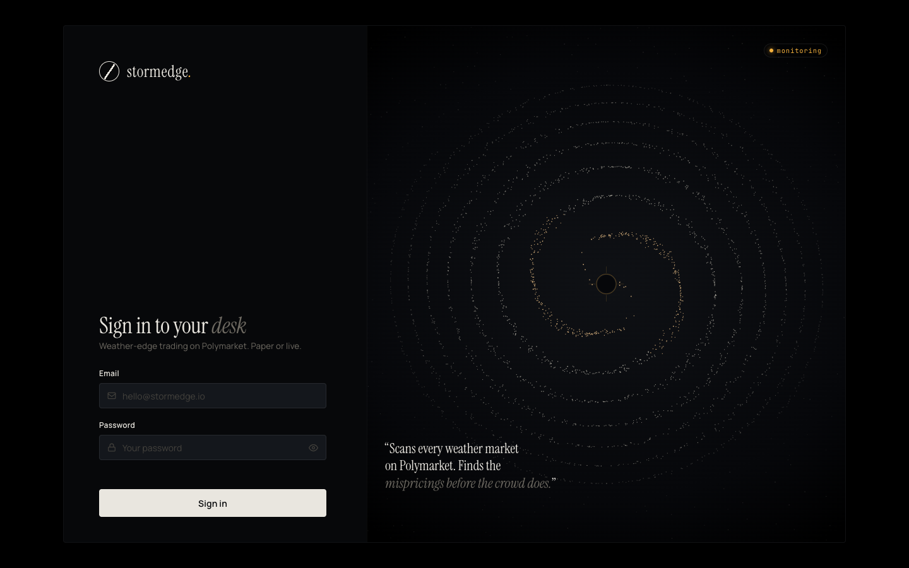
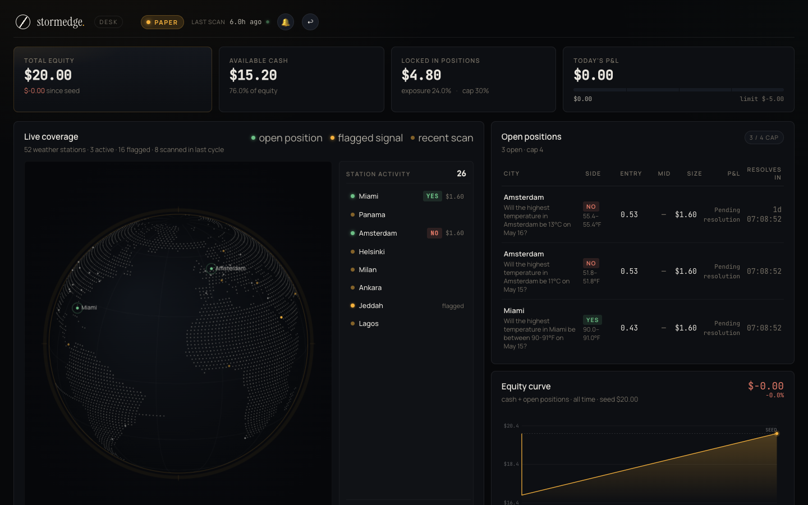
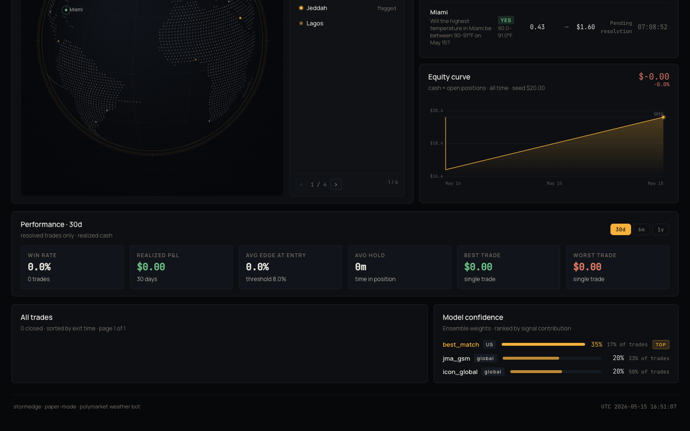

# stormedge

Automated weather market trading bot for [Polymarket](https://polymarket.com), with a live web dashboard. Scans every active weather market, computes edge using a multi-model meteorological ensemble, and sizes positions via fractional Kelly. Runs in paper mode by default.

---

## Screenshots

### Login



### Dashboard Overview



### Activity, Performance, and Model Confidence



## Demo Video

<video controls width="100%">
  <source src="docs/assets/videos/dashboard-walkthrough.mp4" type="video/mp4">
  <source src="docs/assets/videos/dashboard-walkthrough.webm" type="video/webm">
</video>

[Download MP4](docs/assets/videos/dashboard-walkthrough.mp4) · [Download WebM](docs/assets/videos/dashboard-walkthrough.webm)

---

## How it works

1. **Discover** — Fetches all active weather events from Polymarket's Gamma API (tag `weather`, resolving within 72h)
2. **Score** — Ranks candidates by liquidity + price uncertainty; caps at 150 markets per scan to avoid API throttling
3. **Forecast** — Pulls temperature forecasts from [Open-Meteo](https://open-meteo.com) for up to 4 models per city (ECMWF IFS, GFS 0.25°, ICON Global, JMA GSM / GEM Global for Asia-Pacific)
4. **Edge** — Fits a normal distribution over the ensemble, computes bucket probabilities, diffs against market-implied odds
5. **Gate** — Requires ≥ 60% model agreement and spread < 2.7°F before placing a trade
6. **Size** — Fractional Kelly (capped at 8%), hard max $2.00 per position, max 30% total exposure
7. **Monitor** — Checks open positions every 5 minutes; exits on stop-loss (15%) or edge decay

---

## Project structure

```
stormedge/
├── app.py              # Flask dashboard server + bot thread launcher (single entry point)
├── main.py             # Standalone bot runner (no dashboard)
├── config.py           # All env-var configuration with defaults
├── scanner.py          # Market discovery, filtering, opportunity building
├── strategy.py         # Edge calculation, Kelly sizing, signal logging
├── executor.py         # Trade execution (paper + live), position monitoring
├── weather.py          # Open-Meteo API, ensemble weighting, bucket probability
├── db.py               # SQLite schema, query helpers
├── alerts.py           # Trade entry/exit notifications
├── utils.py            # HTTP session, datetime parsing
│
├── web/
│   ├── login.html      # Login page
│   ├── dashboard.html  # Dashboard CSS shell
│   ├── dashboard.jsx   # React SPA (compiled by Babel in-browser)
│   └── globe.js        # Interactive orthographic globe (canvas)
│
├── tests/
│   ├── test_scanner.py
│   ├── test_strategy.py
│   └── test_weather.py
│
├── data/
│   └── bot.db          # SQLite database (auto-created)
│
├── .env.example        # All supported config keys with defaults
├── requirements.txt
├── Dockerfile
└── fly.toml            # Fly.io deployment config
```

---

## Quick start

**Requirements:** Python 3.10+

```bash
git clone https://github.com/your-username/polymarket-weather-bot
cd polymarket-weather-bot

python -m venv .venv && source .venv/bin/activate
pip install -r requirements.txt

cp .env.example .env
# Edit .env — at minimum set DASHBOARD_PASSWORD

python app.py
# Dashboard → http://localhost:7777
```

Default login: `donaldemmaogbame@gmail.com` / `stormedge` (set via `DASHBOARD_EMAIL` / `DASHBOARD_PASSWORD` in `.env`)

---

## Configuration

All settings are environment variables. Copy `.env.example` to `.env` and adjust.

| Variable | Default | Description |
|---|---|---|
| `PAPER_MODE` | `true` | Simulate trades without placing real orders |
| `STARTING_BANKROLL` | `20.0` | Initial bankroll in USDC |
| `DASHBOARD_PASSWORD` | `stormedge` | Dashboard login password |
| `DASHBOARD_EMAIL` | `donaldemmaogbame@gmail.com` | Dashboard login email |
| `EDGE_THRESHOLD` | `0.08` | Minimum edge (8%) required to enter a trade |
| `MIN_MODEL_AGREEMENT` | `0.6` | Minimum fraction of models that must agree |
| `MAX_MODEL_SPREAD` | `2.7` | Maximum model spread in °F before skipping |
| `KELLY_CAP` | `0.08` | Maximum Kelly fraction (8%) |
| `HARD_MAX_POSITION_SIZE` | `2.0` | Hard dollar cap per position |
| `MAX_CONCURRENT_POSITIONS` | `3` | Maximum open positions at once |
| `STOP_LOSS_PCT` | `0.15` | Exit if position drops 15% (checked after 30-min hold) |
| `EXIT_EDGE_FLOOR` | `0.05` | Exit if edge decays below 5% |
| `SCAN_INTERVAL_MINUTES` | `10` | How often to scan for new markets |
| `MONITOR_INTERVAL_MINUTES` | `5` | How often to check open positions |
| `MIN_VOLUME` | `500` | Minimum market liquidity in USDC |
| `MAX_HOURS_TO_RESOLUTION` | `72` | Only trade markets resolving within this window |

Live trading additionally requires:

```
POLYMARKET_PK=0x...
CLOB_API_KEY=...
CLOB_SECRET=...
CLOB_PASS_PHRASE=...
```

---

## Running modes

| Command | What it does |
|---|---|
| `python app.py` | Bot + dashboard together on port 7777 |
| `python main.py` | Bot only, no dashboard |
| `pytest` | Run test suite |

---

## Deploy to Fly.io

```bash
fly launch --no-deploy
fly volumes create bot_data --size 1
fly secrets set PAPER_MODE=false POLYMARKET_PK=0x... CLOB_API_KEY=... CLOB_SECRET=... CLOB_PASS_PHRASE=...
fly deploy
```

The `fly.toml` mounts a persistent volume at `/data` for the SQLite database. Region defaults to `lhr` (London) — change in `fly.toml` to suit your latency needs.

---

## Dashboard

The dashboard is a single-page React app (no build step — Babel runs in-browser) served by Flask. It polls `/api/data` every 30 seconds.

**Panels:**
- **Globe** — Interactive 3D globe showing monitored cities; drag to rotate
- **Portfolio** — Bankroll, daily P&L, open position count, mode
- **Open positions** — Live entries with edge, size, hold time
- **Equity curve** — Bankroll over time
- **Performance** — Win rate, avg edge, avg hold time, Sharpe (last 30d)
- **Recent trades** — Last 10 closed trades with P&L
- **Model confidence** — Ensemble weights ranked by signal contribution

---

## License

MIT
