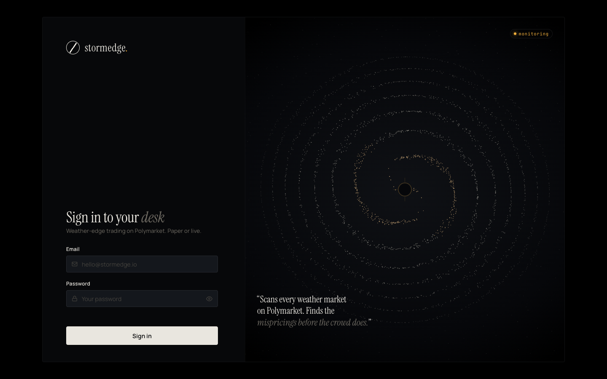
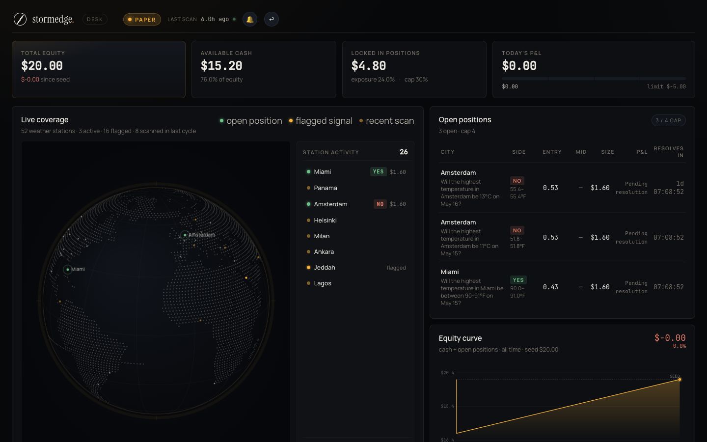
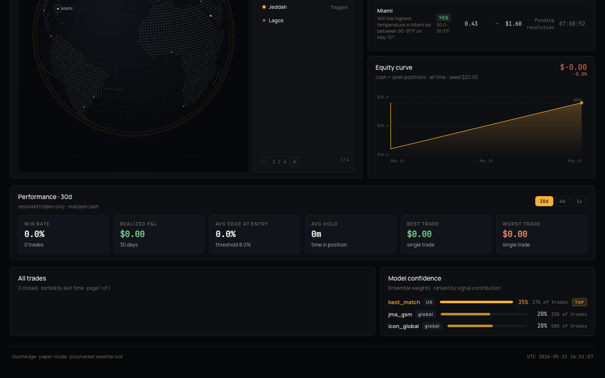

# stormedge

Automated weather market trading bot for [Polymarket](https://polymarket.com), with a live web dashboard. Scans active daily temperature markets, computes edge using a multi-model meteorological ensemble with METAR conditioning, and executes low-temperature `NO` positions sized via flat staking (or fractional Kelly). Runs in paper mode by default.

---

## Screenshots

### Login



### Dashboard Overview



### Activity, Performance, and Model Confidence



## Demo Video

<video controls width="100%">
  <source src="docs/assets/videos/dashboard-walkthrough.mp4" type="video/mp4">
  <source src="docs/assets/videos/dashboard-walkthrough.webm" type="video/webm">
</video>

[Download MP4](docs/assets/videos/dashboard-walkthrough.mp4) · [Download WebM](docs/assets/videos/dashboard-walkthrough.webm)

---

## How it works

1. **Discover** — Scans Polymarket's Gamma API for daily temperature events (tag `weather`, resolving within $\le 48\text{h}$ horizon, minimum \$500 volume).
2. **Forecast & Ensemble** — Pulls numerical weather forecasts from [Open-Meteo](https://open-meteo.com) across 51 global cities (ECMWF IFS, GFS 0.25°, ICON Global/EU/D2, JMA GSM, GEM Global). Applies per-model/per-direction bias corrections, caps forecasting family weights at 35%, and conditions distributions on live METAR airport observations.
3. **Probability & Calibration** — Computes bucket probabilities using a variance-matched Student-$t$ distribution ($\nu=4$), inflates uncertainty on narrow buckets ($\le 2^\circ\text{F}$), applies Platt logistic scaling to eliminate low-probability overconfidence, and enforces a 5% probability floor.
4. **Gate (StormEdge Rule Set)** — Evaluates entry criteria:
   - **Lows-Only & `NO`-Side**: Trades Daily Low markets on the `NO` side only (Highs and `YES` bets disabled based on empirical edge and fee economics).
   - **Direction Agreement**: Raw ensemble mean must agree with betting that temperature misses the bucket.
   - **Forecast Margin**: Ensemble mean must sit $\ge 2.5^\circ\text{F}$ clear of the bucket boundary.
   - **Entry Price Sweet Spot**: Fills must sit in $[0.70, 0.77]$ (70%–77% implied probability).
   - **Liquidity & Depth**: Resting ask depth at or below 0.80 must be $\ge 10\times$ the stake, with order book spread $\le 15\%$.
   - *Non-binding telemetry*: Edge, model agreement, and spread standard deviation are recorded for counterfactual analysis without blocking valid flow.
5. **Size & Execute** — Default flat staking (\$3.00 per trade) with concurrency and portfolio constraints (max 4 concurrent positions, 1 trade per city/date, max 15 trades/day, synoptic correlation limits). Submits marketable limit orders walked through the live order book.
6. **Monitor & Settle** — Checks open positions every 5 minutes. Operates on a hold-to-resolution default; exits early only on Take-Profit ($\ge \$0.98$), physics-gated loss confirmation (METAR observations prove outcome is mathematically dead), or post-date bid salvage.

---

## Project structure

```
stormedge/
├── app.py                   # Flask dashboard server + bot background thread
├── main.py                  # Standalone bot runner & scheduler (no web UI)
├── config.py                # Central configuration, env loader & runtime settings
├── scanner.py               # Market discovery, question/bucket parsing, book depth
├── strategy.py              # StormEdge entry gates, Kelly/flat sizing, signal logging
├── executor.py              # Order execution (paper/live CLOB), position lifecycle & exits
├── weather.py               # Open-Meteo ensemble, Student-t PDF/CDF, Platt calibration
├── intraday.py              # Intraday METAR conditioning & physical diurnal modeling
├── metar.py                 # Airport weather station feed & settlement verification
├── families.py              # Forecasting center family weighting & correlation caps
├── risk.py                  # Synoptic regional & directional portfolio correlation limits
├── db.py                    # SQLite schema, atomic trade transitions, replay logging
├── alerts.py                # Telegram / webhook trade notifications & circuit breaker alerts
├── utils.py                 # HTTP session caching, UTC datetime helpers
├── backtest.py              # Historical Polymarket & NWP ensemble backtest engine
├── calibrate.py             # Model accuracy & probability reliability calibration
├── calibrate_city_sigma.py  # Per-city direction sigma fitting tool
├── backup.py                # Database snapshotting and remote off-box backups
│
├── web/
│   ├── login.html           # Dashboard authentication
│   ├── dashboard.html       # Dashboard HTML container
│   ├── dashboard.jsx        # React SPA frontend (compiled via Babel in-browser)
│   └── globe.js             # Interactive 3D canvas globe
│
├── tests/                   # Pytest unit & integration test suite (700+ tests)
├── data/
│   └── bot.db               # SQLite database (auto-created)
│
├── .env.example             # Supported configuration variables with defaults
├── requirements.txt         # Python dependencies
├── Dockerfile               # Production container image
└── fly.toml                 # Fly.io deployment config
```

---

## Quick start

**Requirements:** Python 3.10+

```bash
git clone https://github.com/DonaldEOgbame/polymarket-weather-bot.git
cd polymarket-weather-bot

python -m venv .venv && source .venv/bin/activate
pip install -r requirements.txt

cp .env.example .env
# Edit .env — at minimum set DASHBOARD_PASSWORD

python app.py
# Dashboard → http://localhost:7777
```

Default login: `donaldemmaogbame@gmail.com` / `stormedge` (configurable via `DASHBOARD_EMAIL` / `DASHBOARD_PASSWORD` in `.env`).

---

## Configuration

Settings are loaded from environment variables and `.env`. Key money/risk knobs can also be modified live via the dashboard Settings tab.

| Variable | Default | Description |
|---|---|---|
| `PAPER_MODE` | `true` | Simulate trades without executing live CLOB orders |
| `STARTING_BANKROLL` | `40.0` | Initial paper bankroll in USDC |
| `FIXED_POSITION_SIZE` | `3.0` | Fixed stake in USDC per trade (set to `0` for Kelly mode) |
| `DAILY_LOSS_STAKES` | `4` | Dynamic daily circuit breaker budget in full stakes ($-12.00$ at \$3 stake) |
| `MAX_CONCURRENT_POSITIONS` | `4` | Maximum concurrent open positions |
| `MAX_TOTAL_EXPOSURE_FRACTION`| `0.70` | Max fraction of bankroll locked across all positions |
| `MAX_TRADES_PER_DAY` | `15` | Hard cap on new trade entries per UTC day |
| `TRADE_LOW_MARKETS` | `true` | Enable trading Daily Low temperature markets |
| `TRADE_HIGH_MARKETS` | `false` | Enable trading Daily High temperature markets |
| `FORECAST_MARGIN_F` | `2.5` | Minimum forecast clearance from nearest bucket edge (°F) |
| `MIN_ENTRY_PRICE` | `0.70` | Minimum fill price floor to enter a trade |
| `MAX_ENTRY_PRICE` | `0.77` | Maximum fill price ceiling to enter a trade |
| `MAX_HOURS_TO_RESOLUTION` | `48.0` | Maximum lead time window in hours to resolution |
| `REQUIRE_SAME_DAY` | `false` | Restrict strictly to same calendar day (governed by 48h horizon) |
| `MIN_DEPTH_MULTIPLE` | `10.0` | Required resting ask depth at/below max entry price as multiple of stake |
| `MAX_ENTRY_SPREAD_FRACTION` | `0.15` | Maximum allowable bid/ask spread fraction |
| `ENABLE_STOP_LOSS` | `false` | Enable price-based stop loss (disabled; defaults to hold-to-resolution) |
| `STOP_LOSS_PCT` | `0.50` | Stop loss drawdown percentage (if stop loss enabled) |
| `TAKE_PROFIT_PRICE` | `0.98` | Exit price target to capture near-settled profits |
| `ENABLE_PHYSICS_EXIT_GATE` | `true` | Allow loss cuts only when METAR proves the bet is mathematically dead |
| `ENABLE_POST_DATE_SALVAGE` | `true` | Salvage bids on confirmed dead positions after target date |
| `SCAN_INTERVAL_MINUTES` | `10` | Interval between market discovery scans |
| `MONITOR_INTERVAL_MINUTES` | `5` | Interval between open position monitoring cycles |

Live trading additionally requires:

```bash
POLYMARKET_PK=0x...
CLOB_API_KEY=...
CLOB_SECRET=...
CLOB_PASS_PHRASE=...
POLYMARKET_SIG_TYPE=0  # 0 for EOA, 1/2/3 for proxy/funder deposit wallets
POLYMARKET_FUNDER=     # Required if POLYMARKET_SIG_TYPE != 0
```

---

## Running modes

| Command | What it does |
|---|---|
| `python app.py` | Bot + Flask dashboard together on port 7777 |
| `python main.py` | Standalone bot runner, no web UI |
| `pytest` | Run comprehensive test suite |
| `python backtest.py` | Run 2-year historical strategy backtest |
| `python calibrate.py` | Check forecast Brier scores & reliability curves |

---

## Deploy to Fly.io

```bash
fly launch --no-deploy
fly volumes create bot_data --size 1
fly secrets set PAPER_MODE=false POLYMARKET_PK=0x... CLOB_API_KEY=... CLOB_SECRET=... CLOB_PASS_PHRASE=...
fly deploy
```

The `fly.toml` configuration mounts a persistent volume at `/data` for the SQLite database.

---

## License

MIT
